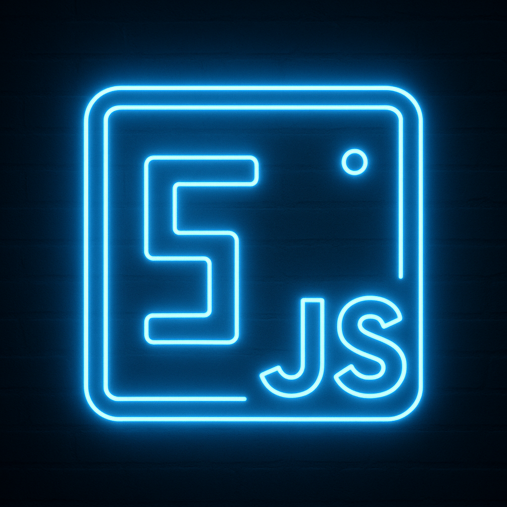

  

# 🐍 Snake Neon Game | João Albero  

  <!-- STATUS -->
  

  <!-- PROJECT TYPE -->
  

  <!-- TECH -->
  
  

  <!-- FRAMEWORKS / LIBRARIES -->
  
  

  <!-- GAME FEATURES -->
  
  
  
  

  <!-- LICENSE -->
  

  <!-- VERSION -->
  

  <!-- AUTHOR -->
  

  <!-- LAST COMMIT -->
  

---

## 🇧🇷 Visão Geral | 🇺🇸 Overview

**🇧🇷 PT-BR**

O **Snake Neon Game** é uma versão web do clássico jogo da cobrinha, com visual neon em tema escuro.  
Focado em ser leve, direto e divertido, ele roda totalmente no navegador (HTML + CSS + JavaScript puro), sem backend.

- Tela com **fundo preto** e **grade sutil neon**
- Cobrinha com **efeito de brilho** na cabeça
- Comida em neon rosa
- **Pontuação**, **High Score** e **Ranking local** usando `localStorage`
- Jogável no teclado (setas) em qualquer navegador moderno

---

**🇺🇸 EN**

**Snake Neon Game** is a web version of the classic Snake game, with a neon look & dark theme.  
It’s lightweight, browser-only (HTML + CSS + vanilla JavaScript), and needs no backend.

- Dark background with a subtle **neon grid**
- Snake with a glowing head effect
- Neon pink food
- **Score**, **High Score** and **Local Ranking** using `localStorage`
- Playable with the arrow keys in any modern browser

---

## 🧠 Features / Funcionalidades

### 🇧🇷 PT-BR

- ✅ Movimento suave baseado em grid (Canvas)
- ✅ Colisão com paredes e com o próprio corpo
- ✅ Aumento de pontuação ao comer a comida
- ✅ **High Score** salvo no `localStorage`
- ✅ **Ranking local TOP 10**, com nome do jogador e pontuação
- ✅ Layout responsivo simples (desktop / mobile horizontal)
- ✅ Visual neon inspirado em estética cyberpunk

---

### 🇺🇸 EN

- ✅ Smooth grid-based movement (Canvas)
- ✅ Collision with walls and snake body
- ✅ Score increase when eating food
- ✅ **High Score** stored using `localStorage`
- ✅ **Local TOP 10 ranking**, with player name and score
- ✅ Simple responsive layout (desktop / horizontal mobile)
- ✅ Neon look inspired by cyberpunk aesthetics

---

## 🕹️ Como jogar | How to play

### 🇧🇷 PT-BR

- Use as **setas do teclado** para mover a cobrinha:
  - ⬆ Cima
  - ⬇ Baixo
  - ⬅ Esquerda
  - ➡ Direita
- Coma a comida neon rosa para ganhar pontos.
- Se bater na parede ou no próprio corpo: **Game Over**.
- Ao perder, digite um nome para registrar sua pontuação no **ranking local**.
- Você pode clicar em **Restart** ou apertar **Enter** para recomeçar.

---

### 🇺🇸 EN

- Use the **arrow keys** to move the snake:
  - ⬆ Up
  - ⬇ Down
  - ⬅ Left
  - ➡ Right
- Eat the neon pink food to gain points.
- If you hit a wall or your own body: **Game Over**.
- After losing, type a name to save your score into the **local ranking**.
- You can click **Restart** or press **Enter** to start again.

---

## 🧩 Tech Stack / Tecnologias

### 🇧🇷 PT-BR

- **HTML5 Canvas** para o campo de jogo  
- **CSS3** com tema neon / dark  
- **JavaScript (ES6+)** para lógica do jogo  
- **LocalStorage** para salvar High Score e Ranking  

---

### 🇺🇸 EN

- **HTML5 Canvas** for the game board  
- **CSS3** with neon / dark theme  
- **JavaScript (ES6+)** for game logic  
- **LocalStorage** to store High Score and Ranking  

---

## 📂 Estrutura de pastas | Folder structure

snake-neon-game/

├─ src/

│  └─ snake-neon-game/

│       ├─ index.html

│       ├─ style.css

│       ├─ script.js

│       └─ assets/

│            ├─ eat.mp3

│            ├─ death.mp3
│
├─ tests/

│  └─ (JS logic tests)

│
├─ README.md

├─ LICENSE

├─ .gitignore

│
├─ icons/

│  ├─ web-icon.png        # ícone da aba do navegador (favicon)

│  └─ readme-icon.png     # ícone usado no README

🚀 Como rodar localmente | How to run locally

## 🇧🇷 PT-BR

1. Clone o repositório:

git clone https://github.com/SEU-USUARIO/snake-neon-game.git

2. Entre na pasta do projeto:

cd snake-neon-game/src/snake-neon-game

3. Abra o arquivo index.html no navegador ou use uma extensão como Live Server no VS Code.

## 🇺🇸 EN

1. Clone the repository:

git clone https://github.com/YOUR-USERNAME/snake-neon-game.git

2. Go to the project folder:

cd snake-neon-game/src/snake-neon-game

3. Open index.html in your browser or use a VS Code extension like Live Server.

🛣️ Roadmap / Ideias futuras
🇧🇷 PT-BR

⏳ Aumentar a velocidade conforme o score sobe

⏳ Adicionar temas alternativos (Neon Blue, Retro Green, etc.)

⏳ Tela de pause

⏳ Som simples de comer / game over

🇺🇸 EN

⏳ Increase speed as the score gets higher

⏳ Add alternative themes (Neon Blue, Retro Green, etc.)

⏳ Pause screen

⏳ Simple eat / game over sound effects

📜 Licença | License
🇧🇷 PT-BR

Este projeto está licenciado sob a MIT License.
Veja o arquivo LICENSE para mais detalhes.

🇺🇸 EN

This project is licensed under the MIT License.
See the LICENSE file for more details.

👤 Autor | Author

Criado por João Albero · 2025
Created by João Albero · 2025